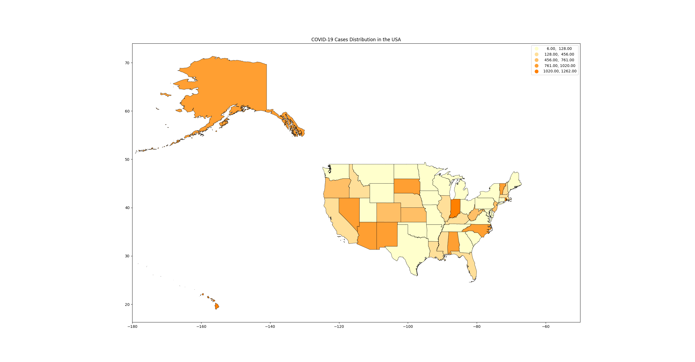

# Geography
要在地图上使用其他颜色来绘制国界，你需要分别设置地理数据的填充颜色和边界颜色。在你的代码中，你已经通过cmap参数设置了填充颜色。要设置边界颜色，你可以使用edgecolor参数。此外，使用linewidth参数可以调整边界线的宽度，以使国界更为显眼。  

以下是如何在你的代码中设置国界颜色的示例，这里假设我们想要将国界绘制为黑色：  

```
import pandas as pd
import geopandas as gpd
import matplotlib.pyplot as plt
import mapclassify
from matplotlib.colors import LinearSegmentedColormap

# 读取CSV文件，假设文件名为'covid_data.csv'
covid_data = pd.read_csv('covid_data.csv', header=None, names=['State', 'Cases'])

# 加载美国各州的地理信息，确保你有一个包含州边界的GeoJSON文件
usa = gpd.read_file('gz_2010_us_040_00_500k.json')

# 将新冠数据合并到地理数据中，这里假设GeoJSON文件中州名的列名为'NAME'
usa_with_covid = usa.set_index('NAME').join(covid_data.set_index('State'))

# 创建一个自定义的橙色渐变颜色映射
orange_cmap = LinearSegmentedColormap.from_list("mycmap", ["#ffffcc", "#ff8000"])

# 绘制地图，使用自定义的橙色渐变颜色映射，根据病例数变化颜色明暗  
# 设置国界颜色为黑色，边界线宽度为0.5  
usa_with_covid.plot(column='Cases', legend=True, cmap=orange_cmap, scheme='NaturalBreaks', k=5,
                    edgecolor='black', linewidth=0.5)

# 设置地图的经度显示范围从-130到-50
plt.xlim(-130, -50)

plt.title('COVID-19 Cases Distribution in the USA')
plt.show()


```
  

在这个示例中，edgecolor='black'设置了边界颜色为黑色，linewidth=0.5设置了边界线的宽度。你可以根据需要调整这些值，比如改变edgecolor为其他颜色代码以使用不同的颜色绘制国界。  

## 加上州名的地图

要在地图上标示出州的名称，你需要遍历每个州的地理数据，获取州的中心点坐标，然后在这些坐标上使用plt.text()函数来绘制文本。这个过程涉及到从GeoDataFrame中提取每个州的中心点（或近似中心点，称为centroid）并在这些点上放置州名。  

以下是如何修改你的代码以包含州名的示例：  

```
import pandas as pd
import geopandas as gpd
import matplotlib.pyplot as plt
import mapclassify
from matplotlib.colors import LinearSegmentedColormap

# 读取CSV文件，假设文件名为'covid_data.csv'
covid_data = pd.read_csv('covid_data.csv', header=None, names=['State', 'Cases'])

# 加载美国各州的地理信息，确保你有一个包含州边界的GeoJSON文件
usa = gpd.read_file('gz_2010_us_040_00_500k.json')

# 将新冠数据合并到地理数据中，这里假设GeoJSON文件中州名的列名为'NAME'
usa_with_covid = usa.set_index('NAME').join(covid_data.set_index('State'))

# 创建一个自定义的橙色渐变颜色映射
orange_cmap = LinearSegmentedColormap.from_list("mycmap", ["#ffffcc", "#ff8000"])

# 绘制地图，使用自定义的橙色渐变颜色映射，根据病例数变化颜色明暗
fig, ax = plt.subplots(1, 1)
usa_with_covid.plot(column='Cases', legend=True, cmap=orange_cmap, scheme='NaturalBreaks', k=5,
                    edgecolor='black', linewidth=0.5, ax=ax)

# 标示出州的名称
for idx, row in usa_with_covid.iterrows():
    plt.text(s=idx, x=row.geometry.centroid.x, y=row.geometry.centroid.y, horizontalalignment='center', fontsize=6)

# 设置地图的经度显示范围从-130到-50
plt.xlim(-130, -50)

plt.title('COVID-19 Cases Distribution in the USA')
plt.show()

```
这段代码中的核心变化是添加了一个循环，它遍历usa_with_covid中的每一行（每个州），使用plt.text()在每个州的中心点位置上绘制该州的名称（idx为州名）。horizontalalignment='center'确保文本在中心点水平居中，fontsize=6设置了文本的字体大小，这个值可以根据实际需要进行调整以保证文本的清晰度和地图的可读性。  

请注意，由于州的地理形状和大小差异很大，某些州名可能不会完美居中或可能会与邻近州的名称重叠。调整字体大小或使用州的不同位置可能有助于改善这一点。  
